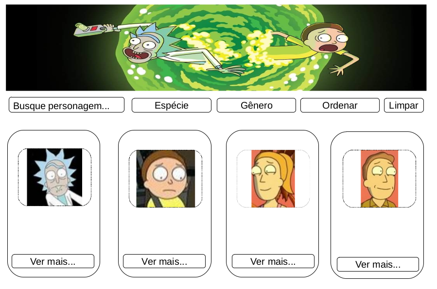

# Rick and Morty Lovers

## Sobre Rick and Morty

[Rick and Morty](https://pt.wikipedia.org/wiki/Rick_and_Morty) é uma série de animação adulta norte-americana de comédia e ficção científica criada por Justin Roiland e Dan Harmon para o bloco de programação noturno Adult Swim, exibido no canal Cartoon Network.

É uma das animações mais insanas e viciantes produzidas até hoje. Criado inicialmente como uma paródia animada do filme [_De Volta para o Futuro_](https://pt.wikipedia.org/wiki/Back_to_the_Future), as aventuras do cientista louco, excêntrico e alcoólatra Rick e seu neto Marty que é facílmente influenciável por ele, conquistou diversos fãs ao redor do mundo.

Rick é um cientista alcoólatra de 70 anos extremamente inteligente que foi morar com a família de sua filha Beth, uma cirurgiã cardíaca de equinos. Ele está sempre em busca de grandes experiências e divide seu tempo entre desenvolver projetos altamente tecnológicos em seu laboratório (garagem da casa da Beth), e em levar seu neto de 14 anos Morty em aventuras perigosas e surreais, indo parar até em diversas dimensões e realidades paralelas. Ele é bem esquentado e sempre sobra para seu neto, Morty, que o acompanha nessas expedições. Combinados com tensões preexistentes dentro da família, esses eventos causam ao sensível Morty muita angústia em casa e na escola.

## 1. Resumo do projeto.

**_Rick and Morty Lovers_** foi pensado e desenvolvido como uma espécie de guia para os fãs da animação. Neste site é possível encontrar os personagens da série e filtrá-los de acordo com a _specie_, _genêro_, _nome do personagem_ e até mesmo em ordem crescente e decrescente conforme a primeira letra do nome. Através da seleção desses filtros, os fãs poderam ver quais o episódios em que os personagens aparecem, assim com a imagem e as demais informações do mesmo.

## 2. Definição do Projeto.

O site foi desenvolvido para que o usuário possa navegar de forma simples e prática, dando destaque aos cards dos personagens e as informações mais relevantes que o usuário deseja encontrar, conforme os estudos realizados através das pesquisas e levantamento das _Histórias de usuários_, já disponibilizada no projeto. Devido a série possuir muitos personagens, e cada um deles com diferentes características, visamos que através dos filtros implementados, a busca fica mais fácil e rápida, facilitando também a escolha de quais episódios desejam assistir.

## 3. Planejamento e Organização.

O projeto foi desenvolvido por mim _Fernanda Monteiro_, sendo o segundo projeto a ser realizado no Bootcamp do Laboratória na turma SAP007, no qual a principal ferramenta utilizada para se organizar foi o Trello.

## 4. Protótipo de baixa fidelidade.

Foi esboçado um projeto em folha de papel, visando um site limpo e de fácil entendimento para o usuário.

## 4. Protótipo de baixa fidelidade.

O protótipo de alta fidelidade foi a princípio desenvolvido na ferramenta do LibreOffice Draw.

## 5. Histórias de usuários

1. "O usuário que está assistindo a série, gostaria de saber mais sobre os personagens, em quais episódios eles aparecem, para que assim possam escolher melhor quais episódios assistirem".

#### Critérios de aceitação:
- [x] O usuário consegue filtrar por spécie e gênero
- [x] O usuário consegue ordenar para ver os personagens em ordem crescente e decrescente
- [x] Ver os personagens em cards
- [x] O usuário pode pesquisar personagens por nome e ver os cards com as informações do personagem.
- [x] O usuário consegue ver uma curiosidade com o total dos personagens e a média de gênero.

#### Definição de pronto:

- [x] Passar nos testes
- [x] Padrão de código: ";" ao final da linha de código e aspas duplas.
- [x] Sem comentários
- [x] Subir pro github
- [x] Sem conflitos/bugs

2. "O usuário quer ver na tela a imagem e as informações do(s) personagem(ns) conforme escolha dos filtros".

#### Critérios de aceitação:
- [x] O usuário conseguirá ver o card na tela com a imagem do personagem e as informações dele.

3. "O usuário poderá pesquisar os personagens pelo nome".
- [x] O usuário conseguirá pesquisar personagens por nome e ver os cards com as informações do personagem.

## 5. Testes de usabilidade

## 6. Tecnologias Utilizadas
HTML 5
CSS3
JavaScript
Node.js
Git
GitHub

## 7. Resultado

## 8. Antes e Depois

## 9. Considerações
