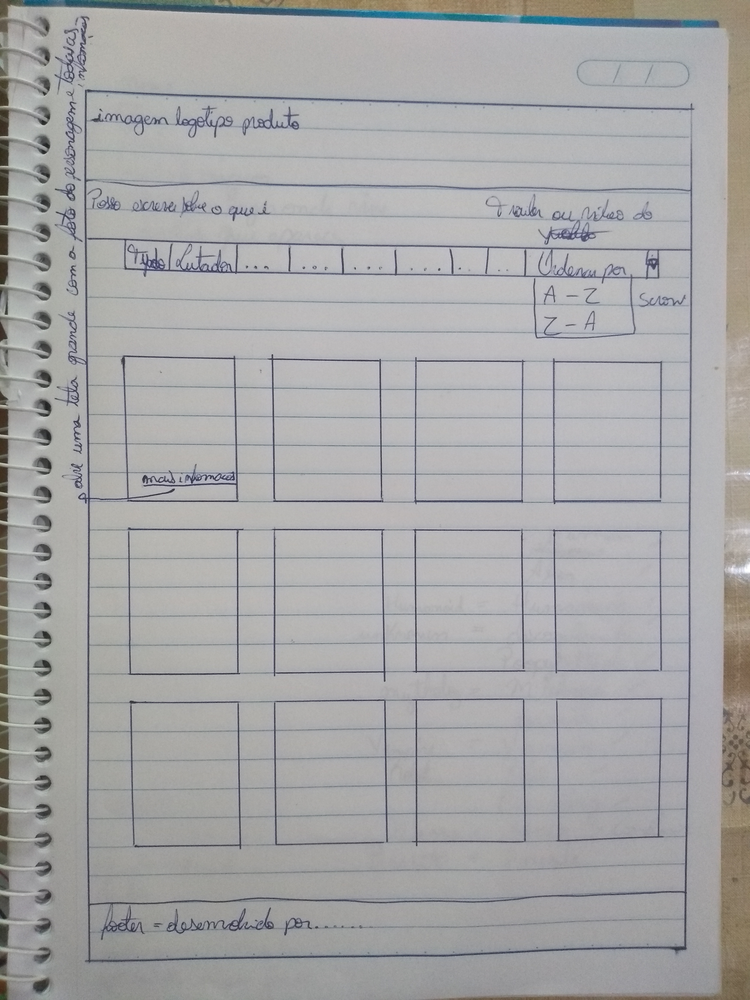

# Rick and Morty Lovers

## Índice

- [1. Resumo do Projeto](#1-resumo-do-projeto)
- [2. Definição do Projeto](#2-definição-do-projeto)
- [3. Planejamento e Organização](#3-planejamento-e-organização)
- [4. Protótipo de baixa fidelidade](#4-protótipo-de-baixa-fidelidade)
- [5. Protótipo de alta fidelidade](#5-protótipo-de-alta-fidelidade)
- [6. Histórias de usuários](#6-histórias-de-usuários)
- [7. Teste de Usabilidade](#7-teste-de-usabilidade)
- [8. Tecnologias Utilizadas](#8-tecnologias-utilizadas)
- [9. Considerações](#9-considerações)

## Sobre Rick and Morty

[Rick and Morty](https://pt.wikipedia.org/wiki/Rick_and_Morty) é uma série de animação adulta norte-americana de comédia e ficção científica criada por Justin Roiland e Dan Harmon para o bloco de programação noturno Adult Swim, exibido no canal Cartoon Network.

É uma das animações mais insanas e viciantes produzidas até hoje. Criado inicialmente como uma paródia animada do filme [_De Volta para o Futuro_](https://pt.wikipedia.org/wiki/Back_to_the_Future), as aventuras do cientista louco, excêntrico e alcoólatra Rick e seu neto Morty que é facílmente influenciável por ele, conquistou diversos fãs ao redor do mundo.

Rick é um cientista alcoólatra de 70 anos extremamente inteligente que foi morar com a família de sua filha Beth, uma cirurgiã cardíaca de equinos. Ele está sempre em busca de grandes experiências e divide seu tempo entre desenvolver projetos altamente tecnológicos em seu laboratório (garagem da casa da Beth), e em levar seu neto de 14 anos Morty em aventuras perigosas e surreais, indo parar até em diversas dimensões e realidades paralelas. Ele é bem esquentado e sempre sobra para seu neto, Morty, que o acompanha nessas expedições. Combinados com tensões preexistentes dentro da família, esses eventos causam ao sensível Morty muita angústia em casa e na escola.

## 1. Resumo do projeto.

**_Rick and Morty Lovers_** foi pensado e desenvolvido como uma espécie de guia para os fãs da animação. Neste site é possível encontrar os personagens da série e filtrá-los de acordo com a _specie_, _genêro_, _status_, _nome do personagem_ e até mesmo em ordem crescente e decrescente conforme a primeira letra do nome. Através da seleção desses filtros, os fãs poderam ver quais os episódios em que os personagens aparecem, assim como a imagem e as demais informações do mesmo.

## 2. Definição do Projeto.

O site foi desenvolvido para que o usuário possa navegar de forma simples e prática, dando destaque aos cards dos personagens e as informações mais relevantes que o usuário deseja encontrar, conforme os estudos realizados através das pesquisas e levantamento das _Histórias de usuários_, já disponibilizada no projeto. Devido a série possuir muitos personagens, e cada um deles com diferentes características, visamos que através dos filtros implementados, a busca fica mais fácil e rápida, facilitando também a escolha de quais episódios desejam assistir.

## 3. Planejamento e Organização.

O projeto foi desenvolvido por mim [_Fernanda Monteiro_](https://github.com/Fe-Monteiro), sendo o segundo projeto a ser realizado no Bootcamp do Laboratória na turma SAP007, no qual a principal ferramenta utilizada para se organizar foi o Trello.

## 4. Protótipo de baixa fidelidade.

Foi esboçado um projeto em folha de papel, visando um site limpo e de fácil entendimento para o usuário. Foi modificada várias coisas, no começo eu faria botões com cada espécie, cada status e cada gẽnero, colocaria também um vídeo no começo, no intuíto de mostrar mais sobre essa série insana, porém, conforme pesquisa de usuário, verifiquei que seria melhor criar os botões com as opções suspensas, pois deixaria mais limpo o site, e quanto ao vídeo, deixaria meu site pesado e poderia dificultar o acesso aos usuários que estivessem com uma conexção ruim de internet.

## 5. Protótipo de alta fidelidade.

O protótipo de alta fidelidade foi desenvolvido na ferramenta do LibreOffice Draw.

## 6. Histórias de usuários.

1. "O usuário que está assistindo a série, gostaria de saber mais sobre os personagens, e em quais episódios eles aparecem, para que assim possam escolher melhor quais episódios assistirem".

#### Critérios de aceitação:
- [x] Ver os personagens em cards.
- [x] Ver as informações de cada personagem assim como os episódios em que aparecem.

2. "O usuário deseja ver em cards o(s) personagem(ns) conforme a sua espécie, gênero, ou status".

#### Critérios de aceitação:
- [x] O usuário consegue filtrar por espécie, gênero e status.

3. "O usuário quer ver na tela o card com a imagem e as informações do(s) personagem(ns) conforme digita o nome do personagem e também em ordem crescente e decrescente".

#### Critérios de aceitação:
- [x] O usuário pode pesquisar personagens por nome e ver os cards com as informações do personagem.
- [x] O usuário consegue ordenar para ver os personagens em ordem crescente e decrescente.

4. "O usuário quer ver na tela a informação de quantos personagens representa determinado filtro e a sua porcentagem em relação ao total de personagens da série".

#### Critérios de aceitação:
- [x] O usuário consegue ver uma curiosidade conforme o filtro realizado, mostrando o total dos personagens e a média que representa determinado filtro.

#### Definição de pronto:
- [x] Passar em 100% nos testes.
- [x] Padrão de código: ";" ao final da linha de código e aspas duplas.
- [x] Sem comentários.
- [x] Subir pro github.
- [x] Sem conflitos/bugs.

## 7. Testes de usabilidade.
Foram realizados testes de usabilidades com pessoas de diferentes faixas etárias:

***Usuários adultos na faixa de idade de 30-40 anos:***
- Achou poluído o layout quando havia vários botões de pesquisa.

Solução: Fiz os botões com opções suspensas.

- Gostaria que ao clicar nos filtros, os cards já aparecessem, sem que houvesse a necessidade de clicar em algum botão para processar o filtro.

Solução: Retirei o botão de filtrar, que deveria recarregar o filtro selecionado após o clique, e coloquei a opção "change" que recarrega os cards assim que o filtro é selecionado.

***Usuários jovens na faixa de idade de 18-30 anos:***
- Gostaria de ver as imagens dos personagens e as principais informações deles já nos cards, sem a necessidade de clicar para que fosse visto.

Solução: Coloquei as principais informações na frente do card junto com o nome e a imagem.

## 8. Tecnologias Utilizadas.
- HTML 5
- CSS3
- JavaScript Vanilla
- Node.js
- Git
- GitHub
- GitHUb Pages
- Jest

## 9. Considerações.

Rick and Morty Lovers foi desenvolvido por mim, _Fernanda Monteiro_ aluna da turma SAP007 da <Laboratória>&#128155;.

Este projeto foi o segundo desafio do Bootcamp e me ensinou sobre:
- Manipulação do DOM, Objetos e Array;
- Funções;
- Desenvolvimento de testes unitários;
- Responsividade;
- UX Design;
- Cálculo agregado;
- GitHub;
- Eslint;
- Aprendder a aprender;

Agradeço por esse grande desafio e pelo apoio das mentoras, psicólogas e colegas de squad.
